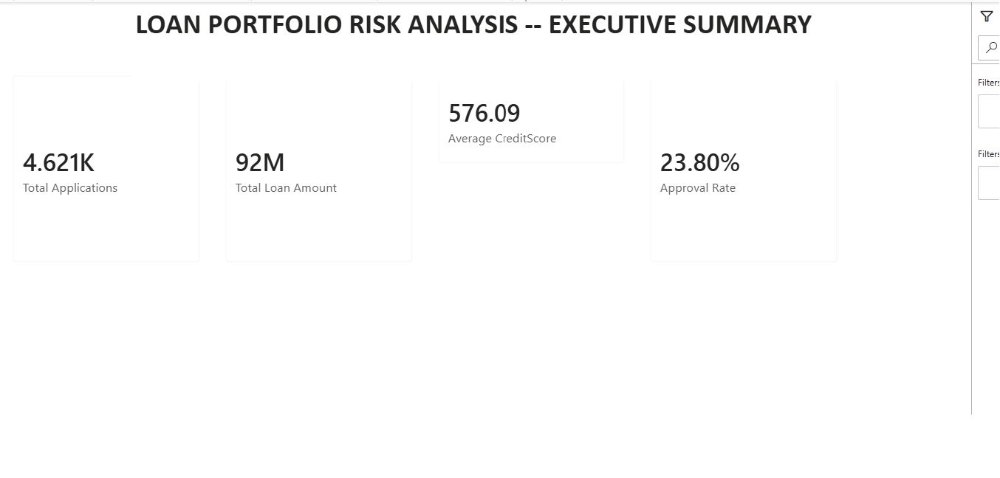
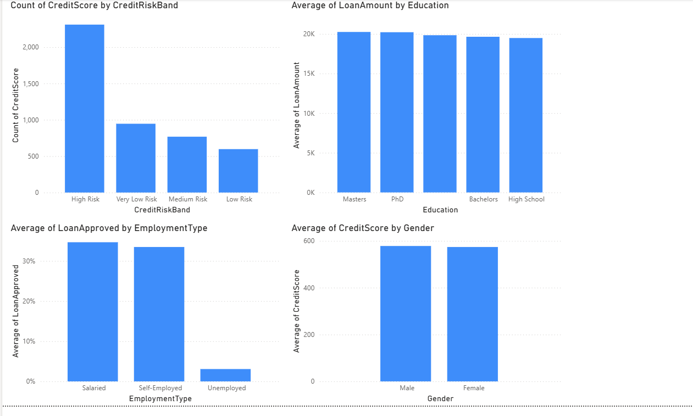
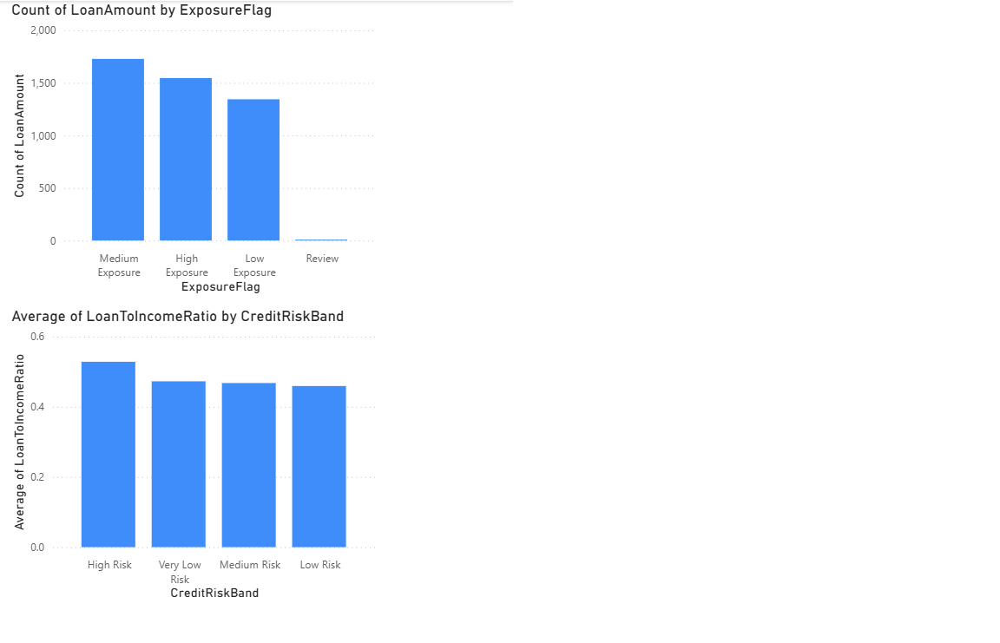
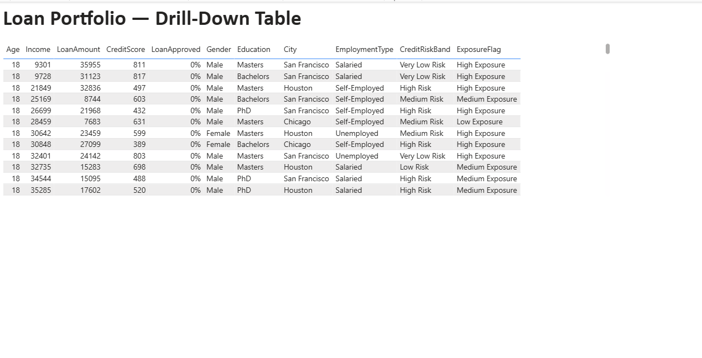

# Loan Portfolio Risk Analytics

## Project Overview

This project demonstrates a loan portfolio risk analytics workflow using a public loan risk prediction dataset. The goal is to analyze loan applications, monitor credit risk, calculate portfolio KPIs, identify high-risk applications, and prepare reporting-ready outputs for dashboard development.

This project is built for portfolio demonstration purposes using public data. It does not contain confidential, company, customer, or proprietary information.

## Business Problem

Financial and risk teams need reliable reporting to monitor loan applications, approval trends, credit quality, exposure risk, and early warning signals. Manual reporting can create delays, inconsistent calculations, duplicate records, missing values, and data quality issues.

This project shows how SQL-based profiling, data quality validation, KPI calculations, and documentation can improve reporting reliability and make the data easier to use for business decisions.

## Objectives

- Profile loan application data for quality issues
- Identify missing values, duplicates, invalid values, and outliers
- Define data quality validation rules
- Calculate portfolio and approval KPIs
- Segment applicants by credit risk bands
- Create source-to-target mapping documentation
- Document data dictionary and data lineage
- Prepare a dashboard-ready reporting layer

## Dataset

The project uses a public loan risk prediction dataset downloaded from Kaggle.

Dataset file:

```text
data/loan_risk_prediction_dataset.csv
```

Main fields include: Age, Income, LoanAmount, CreditScore, YearsExperience, Gender, Education, City, EmploymentType, LoanApproved

## Tech Stack

| Tool / Technology | Purpose |
|---|---|
| SQL | Data profiling, validation checks, KPI calculations, and risk analysis |
| GitHub | Version control and project documentation |
| CSV Dataset | Source dataset for analysis |
| Power BI | Dashboard and reporting layer |
| Python | Data preparation, quality checks, and risk flagging automation |

## Project Structure

```text
loan-portfolio-risk-analytics/
│
├── data/
│   ├── loan_risk_prediction_dataset.csv
│   └── loan_risk_flagged_output.csv
│
├── sql/
│   ├── 01_data_profiling.sql
│   ├── 02_data_quality_checks.sql
│   ├── 03_kpi_calculations.sql
│   └── 04_risk_analysis.sql
│
├── python/
│   ├── 01_data_summary.py
│   ├── 02_data_quality_report.py
│   └── 03_risk_flagging.py
│
├── docs/
│   ├── data_dictionary.md
│   ├── data_quality_rules.md
│   ├── source_to_target_mapping.md
│   ├── data_lineage.md
│   └── project_summary.md
│
├── dashboards/
│   └── dashboard_notes.md
│
└── README.md
```

## SQL Analysis Files

| File | Description |
|---|---|
| 01_data_profiling.sql | Checks total records, sample records, null values, duplicates, and distributions |
| 02_data_quality_checks.sql | Validates data quality rules for age, income, loan amount, credit score, and duplicate records |
| 03_kpi_calculations.sql | Calculates total applications, approval rate, average loan amount, average credit score, and loan-to-income ratio |
| 04_risk_analysis.sql | Creates credit risk bands, exposure flags, high-risk application views, and approval pattern analysis |

## Python Scripts

| File | Description |
|---|---|
| 01_data_summary.py | Generates a quick summary of record counts, columns, and key averages |
| 02_data_quality_report.py | Checks for missing values and invalid/out-of-range values |
| 03_risk_flagging.py | Adds credit risk bands, loan-to-income ratio, and exposure flags, producing the flagged output dataset |

## Documentation Files

| File | Description |
|---|---|
| data_dictionary.md | Defines each field in the dataset |
| data_quality_rules.md | Documents validation rules and data quality dimensions |
| source_to_target_mapping.md | Maps source fields to final reporting fields and KPIs |
| data_lineage.md | Explains how data flows from source to final reporting output |
| project_summary.md | Summarizes the project goal, tools, metrics, and methodology |
| dashboard_notes.md | Documents the Power BI dashboard layout and visuals |

## Key Metrics

- Total loan applications
- Total requested loan amount
- Average loan amount
- Average applicant income
- Average credit score
- Loan approval rate
- High-risk application count
- Loan-to-income ratio
- Approval rate by employment type
- Risk band distribution
- Average loan amount by education
- Average credit score by segment

## Risk Logic Used

Credit score is used to create simple risk bands:

| Credit Score Range | Risk Band |
|---|---|
| Below 580 | High Risk |
| 580–669 | Medium Risk |
| 670–739 | Low Risk |
| 740 and above | Very Low Risk |

Loan-to-income ratio is used to flag exposure risk:

| Loan-to-Income Ratio | Exposure Flag |
|---|---|
| Greater than 0.50 | High Exposure |
| 0.30 to 0.50 | Medium Exposure |
| Less than 0.30 | Low Exposure |

## Methodology

1. Collected public loan risk dataset from Kaggle.
2. Uploaded dataset into the GitHub project.
3. Created SQL profiling queries to understand data structure and quality.
4. Added validation checks for nulls, invalid values, duplicates, and inconsistent data.
5. Created KPI calculation queries for loan applications, approval rate, loan amount, and credit score.
6. Built risk analysis logic using credit score bands and loan-to-income ratio.
7. Automated data quality checks and risk flagging using Python.
8. Documented data dictionary, data quality rules, source-to-target mapping, and data lineage.
9. Built a Power BI dashboard for executive summary, risk overview, segmentation, and drill-down analysis.

## Dashboard

The Power BI dashboard includes:

- Executive KPI cards
- Loan approval summary
- Risk band distribution
- Approval rate by employment type
- Loan amount by education
- Credit score segmentation
- High-risk application table
- Filters for city, gender, education, employment type, and approval status

### Dashboard Screenshots

Executive Summary


Risk Overview & Segmentation


Exposure Analysis


Drill-Down Table


## Business Impact

This project demonstrates how structured analytics can help financial teams:

- Reduce manual reporting effort
- Improve data quality visibility
- Standardize KPI definitions
- Identify high-risk applications
- Improve audit readiness through documentation
- Support faster decision-making through dashboard-ready metrics

## Disclaimer

This is a portfolio project built using a public dataset for learning and demonstration purposes only. It does not represent any employer, client, internal system, confidential report, or proprietary business process.